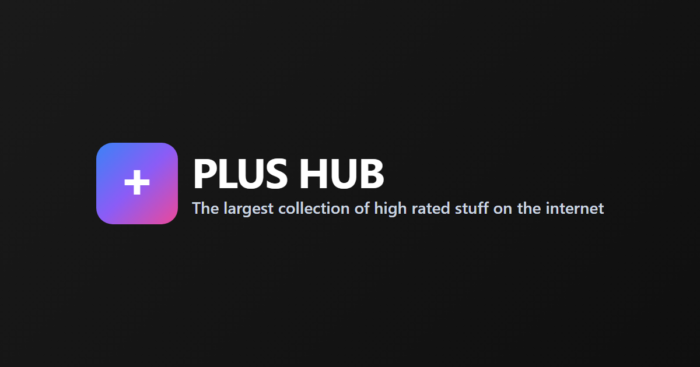

  

# PLUS HUB

**Your Ultimate High Rated Content Hub!**

The largest collection of free resources on the internet - movies, TV shows, anime, music, games, books, software, and more.

🌐 **Website**: [https://plushub.net](https://plushub.net)

## 📚 About

PLUS HUB is a comprehensive resource directory that helps you discover high-quality free content across multiple categories. Whether you're looking for entertainment, educational materials, software, or tools, we've got you covered.

## 🎯 Categories

- 🎬 **Movies, TV Shows & Anime** - Streaming and downloading resources
- 🎵 **Music & Podcasts** - Audio content and radio stations
- 🎮 **Gaming & Emulation** - Games, emulators, and gaming tools
- 📖 **Books, Comics & Manga** - Reading materials in various formats
- 💻 **Software & Tools** - Applications for various platforms
- 🤖 **Artificial Intelligence** - AI resources and tools
- 📱 **Mobile Apps** - Android and iOS applications
- 🐧 **Linux & macOS** - Open-source software and tools
- 🌍 **Non-English Content** - Resources in multiple languages
- 🎓 **Educational** - Learning materials and courses
- 🔒 **Privacy & Security** - Ad-blockers and privacy tools
- 📦 **Miscellaneous** - Other useful resources

## 🤝 Contributing

We welcome contributions! Help us improve PLUS HUB by:

1. **Adding new resources** - Found a great site or tool? Add it!
2. **Improving documentation** - Fix typos, clarify instructions, or add details
3. **Updating information** - Keep existing entries current and accurate
4. **Suggesting improvements** - Share your ideas for better organization

### How to Contribute

1. Click the **"Edit this page on GitHub"** button on any page
2. Make your changes to the markdown file
3. GitHub will automatically fork the repo and create a pull request
4. We'll review your contribution and merge it if approved!

### Contribution Guidelines

- Keep descriptions clear and concise
- Verify links are working before adding
- Follow the existing format and structure
- Be respectful and maintain quality standards

## 📝 Documentation Structure

All documentation is written in Markdown and located in the `docs/` directory:

- `docs/index.md` - Homepage
- `docs/streaming.md` - Movies, TV Shows & Anime
- `docs/audio.md` - Music & Podcasts
- `docs/gaming.md` - Gaming & Emulation
- `docs/reading.md` - Books, Comics & Manga
- And more...

## 🖼️ Assets

- **OG Image**: `og-image.png` - Used for social media previews and sharing

## ⚖️ Disclaimer

This site does not host any files. We only provide links and information about resources available on the internet. Users are responsible for ensuring they comply with applicable laws and terms of service.

## 🔗 Links

- 🌐 **Website**: [plushub.net](https://plushub.net)
- 💬 **Discord**: [Join our community](https://discord.gg/2VWXMpzMj6)
- 📖 **Glossary**: [The Piracy Glossary](https://plushub.net/The-Piracy-Glossary)

---

**Made with ❤️ by the PLUS HUB community**

